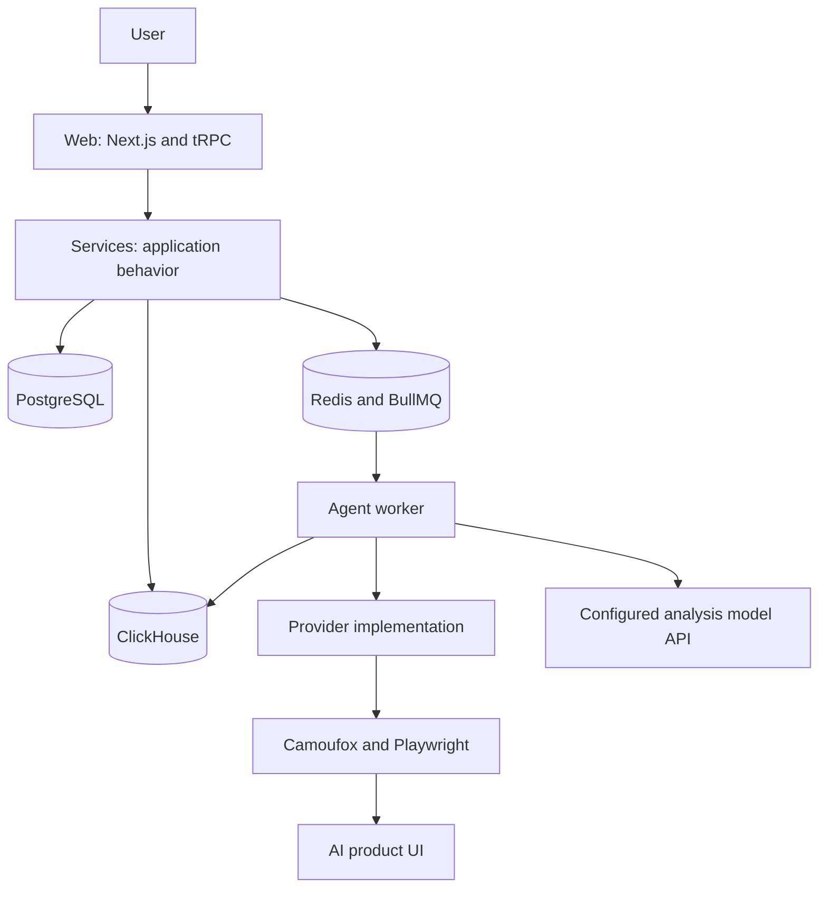

# OneGlanse architecture

This document describes intended ownership boundaries. Code and tests define current implemented behavior. Use CodeGraph to follow a specific call path; use [AGENTS.md](AGENTS.md) for change rules and [CONTRIBUTING.md](CONTRIBUTING.md) for setup.

OneGlanse collects responses from real ChatGPT, Perplexity, Gemini, Claude, and Google AI Overview interfaces. The Agent drives browser sessions; a configured model API analyzes the captured text afterward.

## Repository ownership

| Area | Responsibility |
| --- | --- |
| `apps/web` | Next.js UI, authentication, HTTP/tRPC procedures, and workspace access checks. Routes call shared services for reusable behavior. |
| `apps/agent` | BullMQ workers, browser execution, provider implementations, response and source extraction, and the auth upload endpoint. |
| `packages/services` | Shared application operations: prompt and workspace data access, job submission, scheduling, auth-session storage, and response analysis. |
| `packages/db` | PostgreSQL schema and migrations, plus ClickHouse client and schema configuration. |
| `packages/types`, `packages/errors`, `packages/utils`, `packages/ui` | Shared contracts, errors, low-level utilities, and UI components. |
| `apps/landing`, `docs` | Public landing page and operator documentation. They are separate from the self-hosted Web and Agent runtime. |

## From prompt to result

1. Web saves a workspace's prompt definitions through Services in ClickHouse. Workspace membership, provider selection, selected prompt IDs, and schedule settings live in PostgreSQL.
2. An authorized Web run request, or the internal scheduled-run procedure, calls `submitAgentJobGroup`. Services loads prompts and workspace settings, checks available provider sessions, records progress in Redis, and submits a BullMQ job for each selected provider.
3. Agent consumes provider queues. Its current execution gate allows one provider job at a time across the worker process, even though each provider has its own queue. A provider implementation launches a browser, submits each prompt to the real product UI, and extracts response text and citations.
4. Agent stores captured responses in ClickHouse, then starts background analysis through the configured OpenAI, Anthropic, or OpenAI-compatible endpoint. Analysis data is also stored in ClickHouse. Web reads progress from Redis and results through Services.

Provider differences are expected. Provider configuration, session handling, selectors, prompt submission, and extraction belong under `apps/agent/src/core/providers/<provider>/` or the provider's existing steps. Put behavior in shared browser code only when current providers actually share it. A provider UI change can break extraction without a repository change, so live checks supplement deterministic fixture tests.

## State and scheduling

| Store | Current role |
| --- | --- |
| PostgreSQL | Better Auth data, users and organizations, workspaces, memberships, and workspace configuration. `pg_cron` holds scheduled jobs. |
| ClickHouse | `analytics.user_prompts`, captured responses and sources, and derived analysis data. |
| Redis | BullMQ queues, run progress, and provider stop coordination. |
| Mounted/local filesystem | Provider browser sessions, auth status, and runtime profiles. |

Scheduling is available in the self-host UI. Web saves the schedule on the PostgreSQL workspace record. Services then configures a `pg_cron` job that calls the authenticated internal `runPrompts` tRPC procedure, which submits the same provider jobs as a manual run. Cron setup is best effort after the workspace update, so a saved schedule alone does not prove that the cron job was installed; check scheduler logs when diagnosing missed runs.

## Runtime modes and authentication

`pnpm local` starts PostgreSQL, ClickHouse, and Redis with Docker, then runs Web and Agent on the development machine. Local mode permits interactive provider sign-in and does not select the self-host proxy path. Its UI does not expose people management or recurring schedules.

`pnpm self-host` starts the Compose stack from published images when available, with a local-build fallback for a missing architecture manifest. Self-host mode runs Web and Agent in containers, selects the proxy path for provider browsing, and exposes people management and recurring schedules. Interactive provider sign-in happens on the user's local machine. `pnpm auth` or `pnpm upload:vps` can send saved sessions to that user's Agent upload endpoint using a bearer token; Agent stores them in mounted auth storage. See [SECURITY.md](SECURITY.md) for the transfer boundary.

Provider collection uses Camoufox with Playwright to observe product interfaces. It does not call provider model APIs to collect those responses. Response analysis is a separate step that can call the configured model API or compatible gateway from the user's runtime.

## CI and release

Every PR runs lint, typecheck, tests, dead-code analysis, and the repository build. Relevant Web and Agent source changes also build native AMD64 and ARM64 images and run tests against the finished images. PostgreSQL image changes use a separate build. PR Gate checks the required job results.

For eligible pushes to `main`, CI builds architecture-specific Web and Agent image digests, tests those images, then publishes multiarchitecture manifests with `latest` and commit-based tags. Landing and documentation deployments are separate from the self-host application images. Live provider compatibility remains an external boundary and is not a dependency of deterministic CI.
