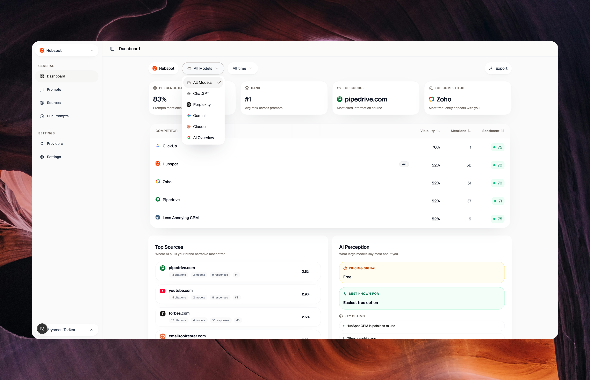

# OneGlanse

**Open-source AI visibility tracking from real AI product interfaces, not model API output.**

OneGlanse tracks how your brand appears in ChatGPT, Perplexity, Gemini, Claude, and Google AI Overview. It runs your prompts through the product interfaces and brings the responses, citations, recommendations, and competing brands into one dashboard.

OneGlanse itself is free and open source to run locally, with no OneGlanse subscription or usage fee. You bring your own provider accounts and analysis model API key. Model API calls analyze responses after collection; they do not collect the provider responses. External model, account, hosting, and proxy costs may apply.

<p align="center">
  
</p>

## What it does

- Runs the prompts you choose in supported AI products and saves the visible responses.
- Tracks whether and where your brand appears, how it is described, and whether it is recommended.
- Shows competing brands that appear in the same answers.
- Records citations and source domains that appear in captured responses.
- Lets you inspect individual responses and follow changes across prompt runs.

The scores are produced by model-backed analysis of captured answers. They help compare runs, but they are interpretations of the response text, not measurements from the AI providers themselves. See the [analysis prompt](packages/services/src/analysis/analysisPrompt.ts) for the scoring instructions.

## Why collect from the browser?

People interact with the finished ChatGPT, Gemini, Perplexity, Claude, and Google AI Overview interfaces. Those interfaces can present citations, source cards, ordering, and formatting that a raw model API response does not show. The agent uses Camoufox and Playwright browser automation to submit prompts and extract the visible response and citations.

Collection uses your own provider accounts and authenticated browser sessions. Results can vary by account, location, prompt, and time. OneGlanse does not claim that a single run represents every user's experience. After collection, analysis sends the response to the model endpoint you configure with your own API key.

## Supported products

| Product | Collection surface |
| --- | --- |
| ChatGPT | Chat interface |
| Perplexity | Search and answer interface |
| Gemini | Chat interface |
| Claude | Chat interface |
| Google AI Overview | Google Search results with AI Overview |

Provider interfaces change. If a collection flow fails, check the [issues](https://github.com/oneglanse/oneglanse/issues) or open a report with the provider and the failed step.

## How it works

1. Add your brand, competitors, and prompts in the web app.
2. The agent opens each selected product in a browser session and captures the response.
3. The app stores the response and asks your configured model to analyze brand visibility, position, sentiment, recommendations, and sources.
4. The dashboard shows results by prompt and over time.

The web app, agent, job queue, and databases have separate responsibilities. See [ARCHITECTURE.md](ARCHITECTURE.md) for their boundaries and data flow.

## Quick start

You need Node.js 20 or newer, pnpm 10 or newer, and Docker. You also need an analysis model API key, such as OpenAI or Anthropic, and accounts for the products you want to track.

```bash
git clone https://github.com/oneglanse/oneglanse.git
cd oneglanse
cp .env.example .env
```

Set one analysis key in `.env`:

```dotenv
OPENAI_API_KEY=your-key
```

Or use Claude:

```dotenv
ANTHROPIC_API_KEY=your-key
ANALYSIS_LLM_PROVIDER=claude
```

Then start the local app:

```bash
pnpm local
```

Open [http://localhost:3000](http://localhost:3000), create an account, connect provider accounts at `/providers`, add prompts, and run them. The local script prepares the browser runtime, starts the supporting services, and applies database migrations. The first start can take longer while Docker images and browser files download.

Browser automation requires a usable desktop session for provider sign-in. Use native macOS, Linux, or Windows for local setup; WSL is not supported for this flow. See the [local setup guide](https://docs.oneglanse.com/local-setup) for the full steps and troubleshooting.

## Local and self-hosted use

| | Local | Self-hosted |
| --- | --- | --- |
| Start | `pnpm local` on your computer | `pnpm self-host` on your server |
| App runtime | Web app and agent run from your checkout | Web app and agent run with Docker Compose |
| Prompt runs | Start runs manually | Schedule recurring runs |
| Provider sign-in | Use the local browser | Sign in locally, then upload sessions to your server |
| Browser traffic | Uses your local network | Configure a residential proxy for VPS runs |

Both modes use infrastructure you control for app data. Self-hosting is intended for an always-on deployment; it needs a server, a domain, provider accounts, an analysis key, and a proxy suitable for the provider sites. The [self-hosted guide](https://docs.oneglanse.com/self-hosted-setup) covers setup, session transfer, and operations. The landing site and documentation site are separate from the app runtime.

## Data and telemetry

Captured responses, analysis results, and provider sessions are stored in the local or self-hosted app stack. Response analysis sends captured text to the OpenAI, Anthropic, or compatible model endpoint you configure. Provider sign-in and self-hosted session transfer use your own accounts and server. Review your model provider's data handling terms before you send responses to it.

The app also sends `user_signed_up` and `user_active` events to PostHog. Each event contains a SHA-256 hash of the app's internal user ID; PostHog adds a receipt timestamp. The telemetry request does not include prompts, captured responses, scores, names, or email addresses. See [the telemetry implementation](apps/web/src/lib/telemetry.ts) for the exact request.

## Documentation and contributing

The [documentation](https://docs.oneglanse.com) has detailed [local setup](https://docs.oneglanse.com/local-setup) and [self-hosted setup](https://docs.oneglanse.com/self-hosted-setup) guides. [ARCHITECTURE.md](ARCHITECTURE.md) explains the repository and runtime boundaries. To report a bug or propose a change, read [CONTRIBUTING.md](CONTRIBUTING.md).

## License

OneGlanse is available under the [MIT License](LICENSE).
